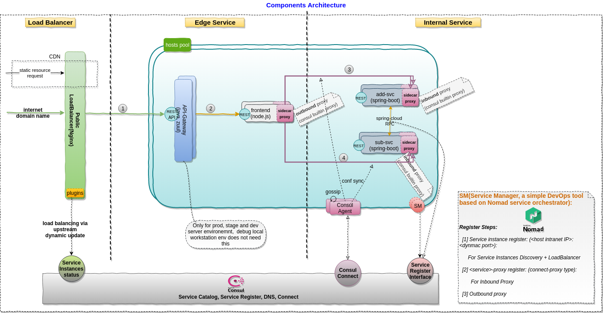

## Introduction

The purpose of this repository aims to provide a hands-on architecture PoC(proof-of-concept) sample that demonstrate how to **build** and **run** a `microservices architecture`(MSA) application(multiple programming languages) with the capabilities of service registry, naming resolution, client service disovery, client load balance, traffic shapping, failure tolerance, etc. 

## PoC Scenario 

The sample contains Java and Node.js modules. In reality, the RPC framework usually are programming language specific, so the challenge for us is how to enable a MSA application with mixed-languages. This sample will show you the approach of service fabric(servicemesh) pattern.

### Overview



### Run the Sample 

All of service instances are using dynamic ports in this sample to demonstrate the auto-scale features. 

> 
> As we want to focus on servicemesh part in the sample, to make the verification(for service discovery and load balancing) ealier, only the internal services are scheduled multiple instances in this sample. If you are interested in the edge services, please refer to [hello-msaproxy](https://github.com/leezhenghui/hello-msaproxy) for details.

#### Steps

- Git clone the project

	On host:
  ```shell
  git clone git@github.com:leezhenghui/hello-servicemesh.git
  ```

- Gradle build/deploy distribution
  
	On host:
	```shell
	cd hello-servicemesh
  gradle deploy 
  ```

- Launch VM 
  
	On host:
	```shell
	cd ops
	vagrant up
  ```

- Provision the VM 
  
	On host:
	```shell
	vagrant provision 
  ```

- Start all nomad jobs 

  For each services, two intances will be created for a load balance, service discovery testing
  
	On host:

	```shell
  vagrant ssh
  ```

	In VM
	```shell
	cd /vagrant/bin
	./start_all_jobs.sh
	```

  After start all jobs, we can see 4 connect-proxy(inbound side proxy) instances created:
	```shell
	root      4222  4180  0 14:25 ?        00:00:00 /opt/consul/bin/consul connect proxy -service add-svc -service-addr 10.10.10.150:22130 -listen :28489 -register -register-id 28489
	root      4223  4171  0 14:25 ?        00:00:00 /opt/consul/bin/consul connect proxy -service add-svc -service-addr 10.10.10.150:24291 -listen :26604 -register -register-id 26604
	root      4273  4203  0 14:25 ?        00:00:00 /opt/consul/bin/consul connect proxy -service sub-svc -service-addr 10.10.10.150:23454 -listen :26351 -register -register-id 26351
	root      4275  4207  0 14:25 ?        00:00:00 /opt/consul/bin/consul connect proxy -service sub-svc -service-addr 10.10.10.150:25384 -listen :28277 -register -register-id 28277
	```

	as well as two upstream-proxy(outbound side proxy) instances:
	```shell
	root      4304  4259  0 14:25 ?        00:00:00 /opt/consul/bin/consul connect proxy -service frontend -upstream sub-svc:28153
	root      4322  4260  0 14:25 ?        00:00:00 /opt/consul/bin/consul connect proxy -service frontend -upstream add-svc:28663
	```

- Run the sample 

  In VM:
	```shell
	./click.sh
  ```

- Run benchmark 

  In VM:
	```shell
	./benchmark.sh
  ```

#### Result of Service Discovery and Load Balance


